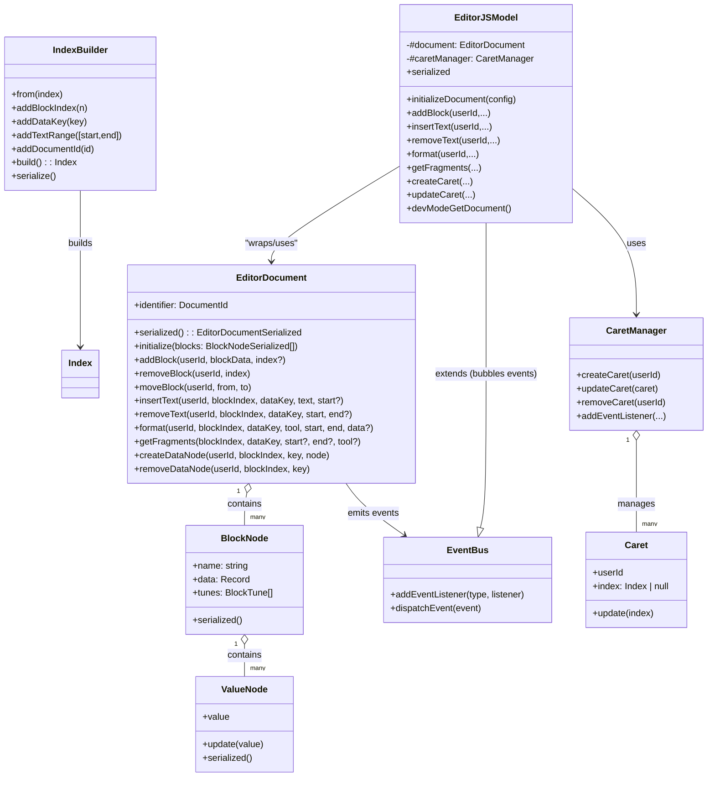
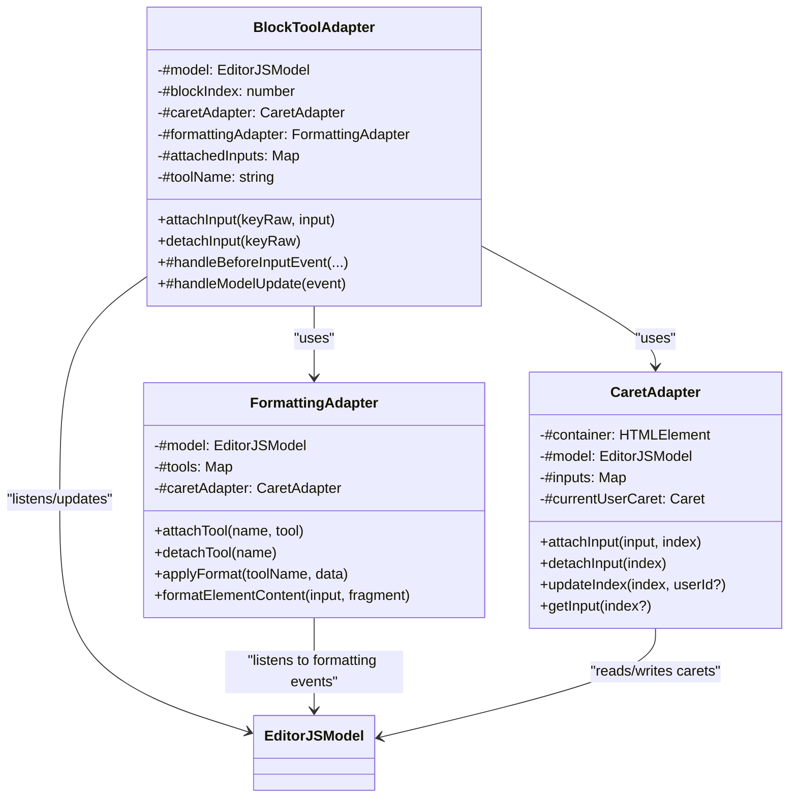
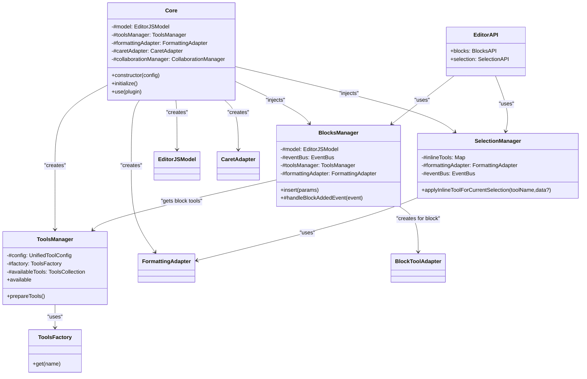
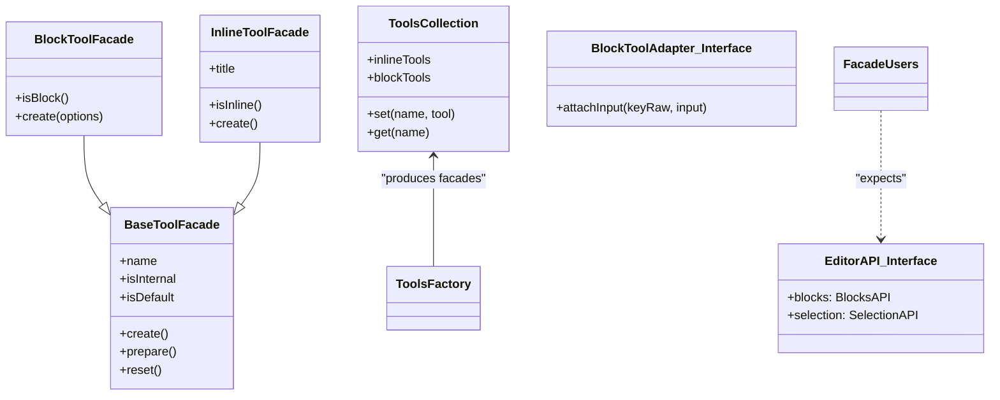
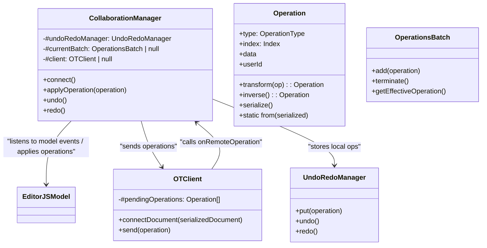
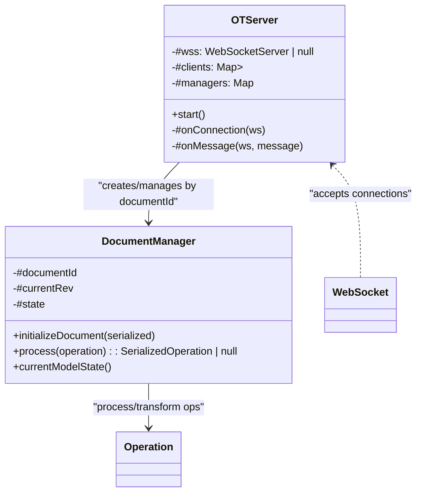
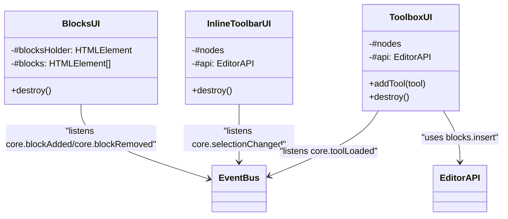

```mermaid
classDiagram
  direction TB

  class EditorDocument {
    +identifier: DocumentId
    +serialized(): EditorDocumentSerialized
    +initialize(blocks: BlockNodeSerialized[])
    +addBlock(userId, blockData, index?)
    +removeBlock(userId, index)
    +moveBlock(userId, from, to)
    +insertText(userId, blockIndex, dataKey, text, start?)
    +removeText(userId, blockIndex, dataKey, start, end?)
    +format(userId, blockIndex, dataKey, tool, start, end, data?)
    +getFragments(blockIndex, dataKey, start?, end?, tool?)
    +createDataNode(userId, blockIndex, key, node)
    +removeDataNode(userId, blockIndex, key)
  }

  class EditorJSModel {
-#document: EditorDocument
-#caretManager: CaretManager
+serialized
+initializeDocument(config)
+addBlock(userId,...)
+insertText(userId,...)
+removeText(userId,...)
+format(userId,...)
+getFragments(...)
+createCaret(...)
+updateCaret(...)
+devModeGetDocument()
}

class BlockNode {
+name: string
+data: Record<string,ValueNode|TextNode>
+tunes: BlockTune[]
+serialized()
}

class ValueNode {
+value
+update(value)
+serialized()
}

class Index
class IndexBuilder {
+from(index)
+addBlockIndex(n)
+addDataKey(key)
+addTextRange([start,end])
+addDocumentId(id)
+build(): Index
+serialize()
}

class CaretManager {
+createCaret(userId)
+updateCaret(caret)
+removeCaret(userId)
+addEventListener(...)
}

class Caret {
+userId
+index: Index | null
+update(index)
}

class EventBus {
+addEventListener(type, listener)
+dispatchEvent(event)
}

%% relationships
EditorJSModel --> EditorDocument : "wraps/uses"
EditorDocument "1" o-- "many" BlockNode : contains
BlockNode "1" o-- "many" ValueNode : contains
EditorDocument --> EventBus : emits events
EditorJSModel --|> EventBus : extends (bubbles events)
EditorJSModel --> CaretManager : uses
CaretManager "1" o-- "many" Caret : manages
IndexBuilder --> Index : builds

```

```mermaid
classDiagram
  direction TB

  class CaretAdapter {
    -#container: HTMLElement
    -#model: EditorJSModel
    -#inputs: Map<string,HTMLElement>
    -#currentUserCaret: Caret
    +attachInput(input, index)
    +detachInput(index)
    +updateIndex(index, userId?)
    +getInput(index?)
  }

  class BlockToolAdapter {
    -#model: EditorJSModel
    -#blockIndex: number
    -#caretAdapter: CaretAdapter
    -#formattingAdapter: FormattingAdapter
    -#attachedInputs: Map<DataKey,HTMLElement>
    -#toolName: string
    +attachInput(keyRaw, input)
    +detachInput(keyRaw)
    +#handleBeforeInputEvent(...)
    +#handleModelUpdate(event)
  }

  class FormattingAdapter {
    -#model: EditorJSModel
    -#tools: Map<InlineToolName, InlineTool>
    -#caretAdapter: CaretAdapter
    +attachTool(name, tool)
    +detachTool(name)
    +applyFormat(toolName, data)
    +formatElementContent(input, fragment)
  }

  %% relations
  BlockToolAdapter --> EditorJSModel : "listens/updates"
  BlockToolAdapter --> CaretAdapter : "uses"
  BlockToolAdapter --> FormattingAdapter : "uses"
  FormattingAdapter --> EditorJSModel : "listens to formatting events"
  CaretAdapter --> EditorJSModel : "reads/writes carets"

```

```mermaid
classDiagram
  direction TB

  class Core {
    -#model: EditorJSModel
    -#toolsManager: ToolsManager
    -#formattingAdapter: FormattingAdapter
    -#caretAdapter: CaretAdapter
    -#collaborationManager: CollaborationManager
    +constructor(config)
    +initialize()
    +use(plugin)
  }

  class ToolsManager {
    -#config: UnifiedToolConfig
    -#factory: ToolsFactory
    -#availableTools: ToolsCollection
    +prepareTools()
    +available
  }

  class ToolsFactory {
    +get(name)
  }

  class BlocksManager {
    -#model: EditorJSModel
    -#eventBus: EventBus
    -#toolsManager: ToolsManager
    -#formattingAdapter: FormattingAdapter
    +insert(params)
    +#handleBlockAddedEvent(event)
  }

  class SelectionManager {
    -#inlineTools: Map
    -#formattingAdapter: FormattingAdapter
    -#eventBus: EventBus
    +applyInlineToolForCurrentSelection(toolName,data?)
  }

  class EditorAPI {
    +blocks: BlocksAPI
    +selection: SelectionAPI
  }

  %% relations
  Core --> EditorJSModel : "creates"
  Core --> ToolsManager : "creates"
  Core --> CaretAdapter : "creates"
  Core --> FormattingAdapter : "creates"
  Core --> BlocksManager : "injects"
  Core --> SelectionManager : "injects"
  ToolsManager --> ToolsFactory : "uses"
  BlocksManager --> ToolsManager : "gets block tools"
  BlocksManager --> BlockToolAdapter : "creates for block"
  SelectionManager --> FormattingAdapter : "uses"
  EditorAPI --> BlocksManager : "uses"
  EditorAPI --> SelectionManager : "uses"
```

```mermaid
classDiagram
  direction TB

  class BaseToolFacade {
    +name
    +isInternal
    +isDefault
    +create()
    +prepare()
    +reset()
  }

  class BlockToolFacade {
    +isBlock()
    +create(options)
  }

  class InlineToolFacade {
    +isInline()
    +create()
    +title
  }

  class ToolsCollection {
    +set(name, tool)
    +get(name)
    +inlineTools
    +blockTools
  }

  class EditorAPI_Interface {
    +blocks: BlocksAPI
    +selection: SelectionAPI
  }

  class BlockToolAdapter_Interface {
    +attachInput(keyRaw, input)
  }

  %% inheritance
  BlockToolFacade --|> BaseToolFacade
  InlineToolFacade --|> BaseToolFacade

  %% relations
  ToolsCollection <-- ToolsFactory : "produces facades"
  FacadeUsers ..> EditorAPI_Interface : "expects"
```

```mermaid
classDiagram
  direction TB

  class CollaborationManager {
    -#undoRedoManager: UndoRedoManager
    -#currentBatch: OperationsBatch | null
    -#client: OTClient | null
    +connect()
    +applyOperation(operation)
    +undo()
    +redo()
  }

  class OTClient {
    -#pendingOperations: Operation[]
    +connectDocument(serializedDocument)
    +send(operation)
  }

  class Operation {
    +type: OperationType
    +index: Index
    +data
    +userId
    +transform(op): Operation
    +inverse(): Operation
    +serialize()
    +static from(serialized)
  }

  class OperationsBatch {
    +add(operation)
    +terminate()
    +getEffectiveOperation()
  }

  class UndoRedoManager {
    +put(operation)
    +undo()
    +redo()
  }

  %% relations
  CollaborationManager --> EditorJSModel : "listens to model events / applies operations"
  CollaborationManager --> OTClient : "sends operations"
  CollaborationManager --> UndoRedoManager : "stores local ops"
  OTClient --> CollaborationManager : "calls onRemoteOperation"
```

```mermaid
classDiagram
  direction TB

  class OTServer {
    -#wss: WebSocketServer | null
    -#clients: Map<DocumentId, Set<WebSocket>>
    -#managers: Map<DocumentId, DocumentManager>
    +start()
    -#onConnection(ws)
    -#onMessage(ws, message)
  }

  class DocumentManager {
    -#documentId
    -#currentRev
    -#state
    +initializeDocument(serialized)
    +process(operation): SerializedOperation | null
    +currentModelState()
  }

  %% relations
  OTServer --> DocumentManager : "creates/manages by documentId"
  OTServer <.. WebSocket : "accepts connections"
  DocumentManager --> Operation : "process/transform ops"
```

```mermaid
classDiagram
  direction TB

  class BlocksUI {
    -#blocksHolder: HTMLElement
    -#blocks: HTMLElement[]
    +destroy()
  }

  class InlineToolbarUI {
    -#nodes
    -#api: EditorAPI
    +destroy()
  }

  class ToolboxUI {
    -#nodes
    -#api: EditorAPI
    +addTool(tool)
    +destroy()
  }

  %% relations
  BlocksUI --> EventBus : "listens core.blockAdded/core.blockRemoved"
  InlineToolbarUI --> EventBus : "listens core.selectionChanged"
  ToolboxUI --> EventBus : "listens core.toolLoaded"
  ToolboxUI --> EditorAPI : "uses blocks.insert"
```
