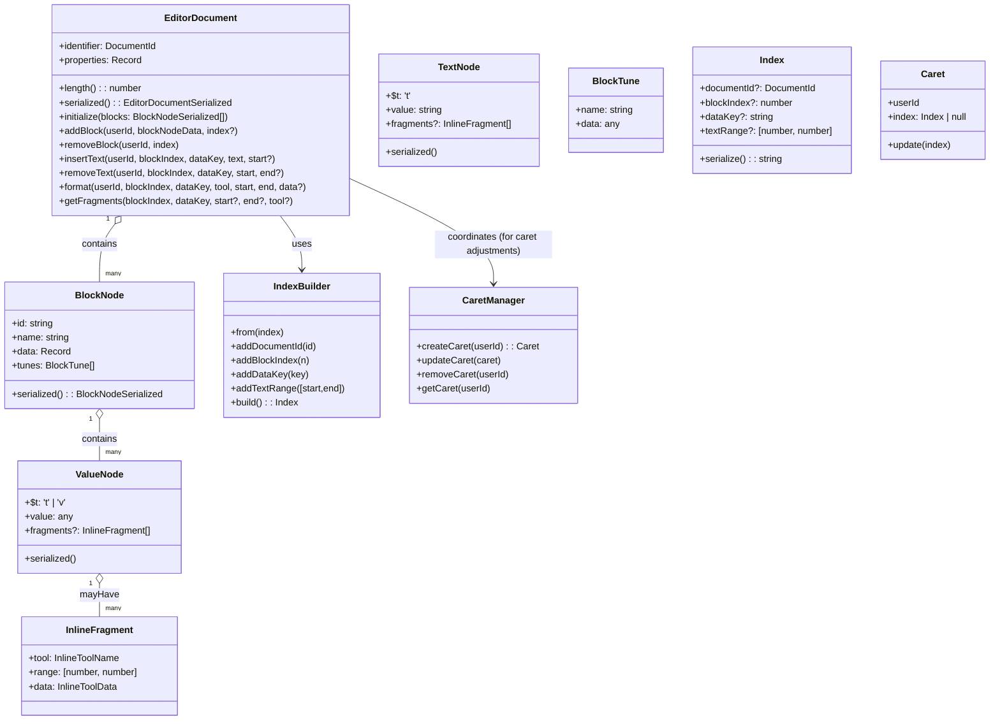

```mermaid
classDiagram
  direction TB
  %% Core model entities
  class EditorDocument {
    +identifier: DocumentId
    +properties: Record<string, unknown>
    +length(): number
    +serialized(): EditorDocumentSerialized
    +initialize(blocks: BlockNodeSerialized[])
    +addBlock(userId, blockNodeData, index?)
    +removeBlock(userId, index)
    +insertText(userId, blockIndex, dataKey, text, start?)
    +removeText(userId, blockIndex, dataKey, start, end?)
    +format(userId, blockIndex, dataKey, tool, start, end, data?)
    +getFragments(blockIndex, dataKey, start?, end?, tool?)
  }

  class BlockNode {
    +id: string
    +name: string
    +data: Record<string, ValueNode | TextNode>
    +tunes: BlockTune[]
    +serialized(): BlockNodeSerialized
  }

  class ValueNode {
    +$t: 't' | 'v'
    +value: any
    +fragments?: InlineFragment[]
    +serialized()
  }

  class TextNode {
    +$t: 't'
    +value: string
    +fragments?: InlineFragment[]
    +serialized()
  }

  class InlineFragment {
    +tool: InlineToolName
    +range: [number, number]
    +data: InlineToolData
  }

  class BlockTune {
    +name: string
    +data: any
  }

  class Index {
    +documentId?: DocumentId
    +blockIndex?: number
    +dataKey?: string
    +textRange?: [number, number]
    +serialize(): string
  }

  class IndexBuilder {
    +from(index)
    +addDocumentId(id)
    +addBlockIndex(n)
    +addDataKey(key)
    +addTextRange([start,end])
    +build(): Index
  }

  class CaretManager {
    +createCaret(userId): Caret
    +updateCaret(caret)
    +removeCaret(userId)
    +getCaret(userId)
  }

  class Caret {
    +userId
    +index: Index | null
    +update(index)
  }

  %% relations
  EditorDocument "1" o-- "many" BlockNode : contains
  BlockNode "1" o-- "many" ValueNode : contains
  ValueNode "1" o-- "many" InlineFragment : mayHave
  EditorDocument --> IndexBuilder : uses
  EditorDocument --> CaretManager : coordinates (for caret adjustments)
```
