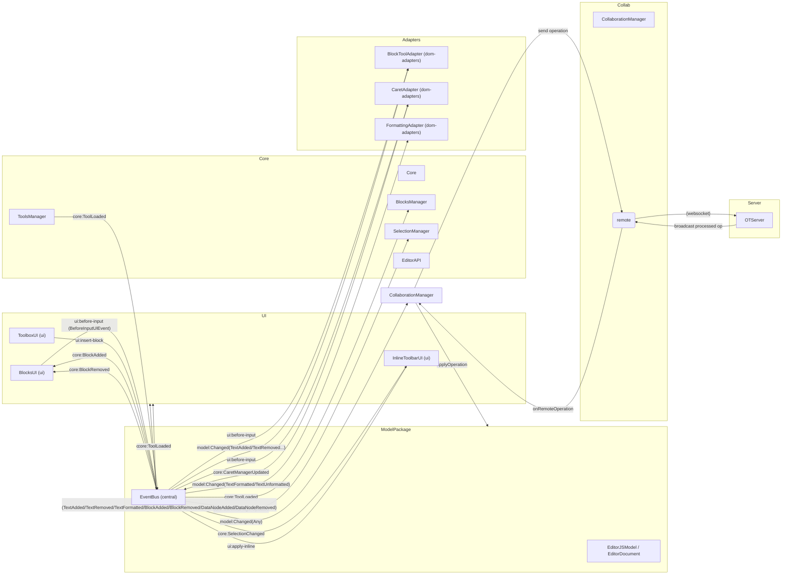

```mermaid
flowchart LR
  subgraph UI
    BlocksUI["BlocksUI (ui)"]
    InlineToolbar["InlineToolbarUI (ui)"]
    Toolbox["ToolboxUI (ui)"]
  end

  subgraph Core
    CoreComp["Core"]
    BlocksManager["BlocksManager"]
    SelectionManager["SelectionManager"]
    ToolsManager["ToolsManager"]
    EditorAPI["EditorAPI"]
  end

  subgraph Adapters
    BlockToolAdapter["BlockToolAdapter (dom-adapters)"]
    CaretAdapter["CaretAdapter (dom-adapters)"]
    FormattingAdapter["FormattingAdapter (dom-adapters)"]
  end

  subgraph ModelPackage
    Model["EditorJSModel / EditorDocument"]
    EventBus["EventBus (central)"]
  end

  subgraph Collab
    CollabMgr["CollaborationManager"]
    OTClient["OTClient"]
  end

  subgraph Server
    OTServer["OTServer"]
  end

  %% UI -> events emitted
  BlocksUI -- "ui:before-input (BeforeInputUIEvent)" --> EventBus
  InlineToolbar -- "ui:apply-inline" --> EventBus
  Toolbox -- "ui:insert-block" --> EventBus

  %% Event bus routes into adapters/core
  EventBus -- "ui:before-input" --> BlockToolAdapter
  EventBus -- "ui:before-input" --> CaretAdapter
  EventBus -- "core:ToolLoaded" --> UI
  EventBus -- "core:BlockAdded" --> BlocksUI
  EventBus -- "core:BlockRemoved" --> BlocksUI
  EventBus -- "core:SelectionChanged" --> InlineToolbar

  %% Model emits low-level change events on EventBus
  ModelPackage -- "model:Changed (TextAdded/TextRemoved/TextFormatted/BlockAdded/BlockRemoved/DataNodeAdded/DataNodeRemoved)" --> EventBus

  %% Consumers of model events
  EventBus -- "model:Changed(TextAdded/TextRemoved...)" --> BlockToolAdapter
  EventBus -- "model:Changed(TextFormatted/TextUnformatted)" --> FormattingAdapter
  EventBus -- "model:Changed(Any)" --> CollaborationManager

  %% Selection caret flow
  CaretAdapter -- "core:CaretManagerUpdated" --> EventBus
  EventBus -- "core:CaretManagerUpdated" --> SelectionManager

  %% Tools lifecycle
  ToolsManager -- "core:ToolLoaded" --> EventBus
  EventBus -- "core:ToolLoaded" --> BlocksManager
  EventBus -- "core:ToolLoaded" --> UI(Toolbox)

  %% Collaboration send/receive
  CollaborationManager -- send operation --> OTClient
  OTClient --(websocket)--> OTServer
  OTServer -- broadcast processed op --> OTClient(remote)
  OTClient -- onRemoteOperation --> CollaborationManager
  CollaborationManager -- applyOperation --> ModelPackage

  %% Notes
  classDef producers fill:#e3f2fd,stroke:#0288d1;
  classDef consumers fill:#f1f8e9,stroke:#33691e;
  class BlocksUI,InlineToolbar,Toolbox,ToolsManager,ModelPackage,EventBus,BlockToolAdapter,CaretAdapter,FormattingAdapter,CollabMgr,OTClient,OTServer,BlocksManager,SelectionManager coreproducers;
```
