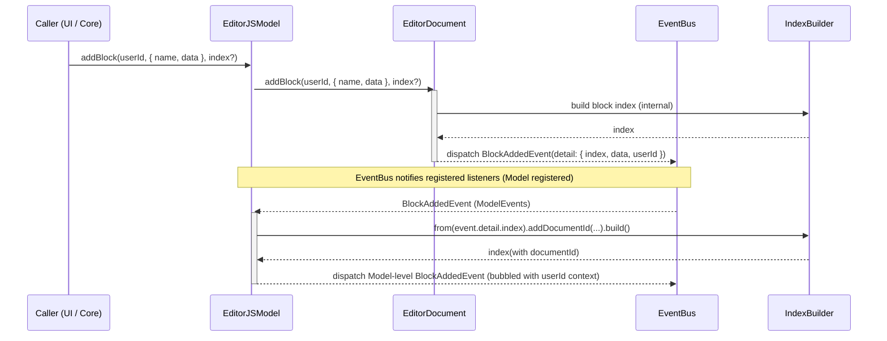
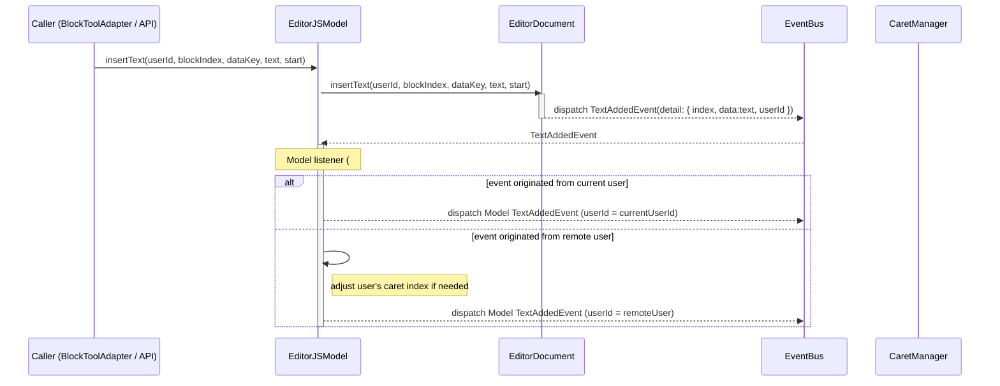
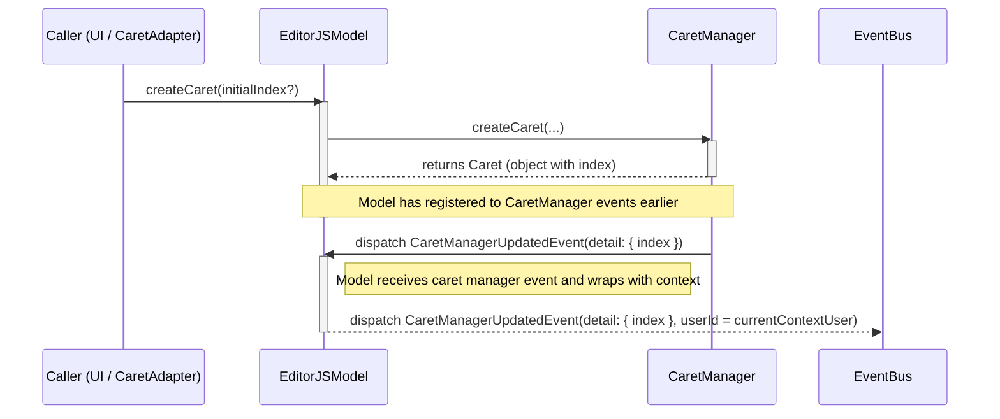
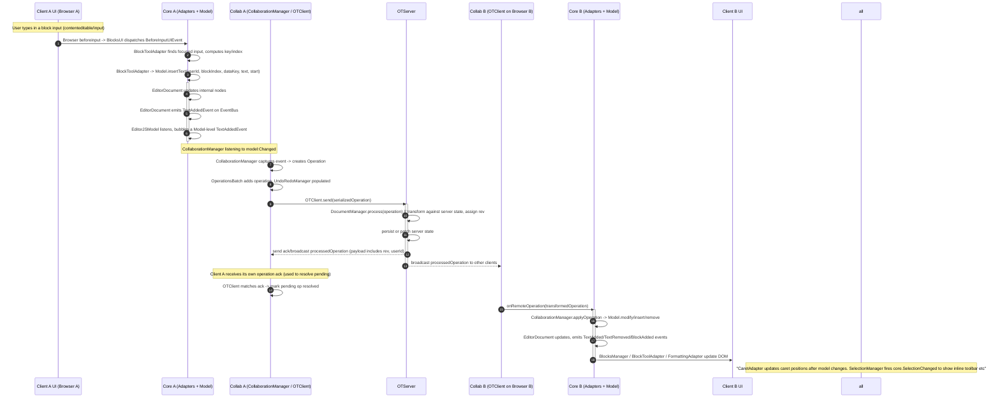

```mermaid
sequenceDiagram
  participant Caller as Caller (UI / Core)
  participant Model as EditorJSModel
  participant Doc as EditorDocument
  participant EB as EventBus
  participant IB as IndexBuilder

  Caller->>Model: addBlock(userId, { name, data }, index?)
  activate Model
  Model->>Doc: addBlock(userId, { name, data }, index?)
  activate Doc
  Doc->>IB: build block index (internal)
  IB-->>Doc: index
  Doc-->>EB: dispatch BlockAddedEvent(detail: { index, data, userId })
  deactivate Doc
  Note over EB,Model: EventBus notifies registered listeners (Model registered)
  EB-->>Model: BlockAddedEvent (ModelEvents)
  activate Model
  Model->>IB: from(event.detail.index).addDocumentId(...).build()
  IB-->>Model: index(with documentId)
  Model-->>EB: dispatch Model-level BlockAddedEvent (bubbled with userId context)
  deactivate Model
```

```mermaid
sequenceDiagram
  participant Caller as Caller (BlockToolAdapter / API)
  participant Model as EditorJSModel
  participant Doc as EditorDocument
  participant EB as EventBus
  participant CaretMgr as CaretManager

  Caller->>Model: insertText(userId, blockIndex, dataKey, text, start)
  activate Model
  Model->>Doc: insertText(userId, blockIndex, dataKey, text, start)
  activate Doc
  Doc-->>EB: dispatch TextAddedEvent(detail: { index, data:text, userId })
  deactivate Doc
  EB-->>Model: TextAddedEvent
  activate Model
  Note over Model: Model listener (#listenAndBubbleDocumentEvents) receives Doc event
  alt event originated from current user
    Model-->>EB: dispatch Model TextAddedEvent (userId = currentUserId)
  else event originated from remote user
    Model->>Model: #updateUserCaretByRemoteChange(event)
    Note right of Model: adjust user's caret index if needed
    Model-->>EB: dispatch Model TextAddedEvent (userId = remoteUser)
  end
  deactivate Model

```

```mermaid
sequenceDiagram
  participant Caller as Caller (UI / CaretAdapter)
  participant Model as EditorJSModel
  participant CaretMgr as CaretManager
  participant EB as EventBus

  Caller->>Model: createCaret(initialIndex?)
  activate Model
  Model->>CaretMgr: createCaret(...)
  activate CaretMgr
  CaretMgr-->>Model: returns Caret (object with index)
  deactivate CaretMgr
  Note over Model,CaretMgr: Model has registered to CaretManager events earlier
  deactivate Model

  %% simulate caret update happening (e.g., selection change)
  CaretMgr->>Model: dispatch CaretManagerUpdatedEvent(detail: { index })
  activate Model
  Note right of Model: Model receives caret manager event and wraps with context
  Model-->>EB: dispatch CaretManagerUpdatedEvent(detail: { index }, userId = currentContextUser)
  deactivate Model

```

```mermaid
sequenceDiagram
  autonumber
  participant ClientA_UI as Client A UI (Browser A)
  participant ClientA_Core as Core A (Adapters + Model)
  participant ClientA_Collab as Collab A (CollaborationManager / OTClient)
  participant Server as OTServer
  participant ClientB_Collab as Collab B (OTClient on Browser B)
  participant ClientB_Core as Core B (Adapters + Model)
  participant ClientB_UI as Client B UI

  Note over ClientA_UI: User types in a block input (contenteditable/input)
  ClientA_UI->>ClientA_Core: Browser beforeinput -> BlocksUI dispatches BeforeInputUIEvent
  ClientA_Core->>ClientA_Core: BlockToolAdapter finds focused input, computes key/index
  ClientA_Core->>ClientA_Core: BlockToolAdapter -> Model.insertText(userId, blockIndex, dataKey, text, start)
  activate ClientA_Core
  ClientA_Core->>ClientA_Core: EditorDocument updates internal nodes
  ClientA_Core->>ClientA_Core: EditorDocument emits TextAddedEvent on EventBus
  ClientA_Core->>ClientA_Core: EditorJSModel listens, bubbles a Model-level TextAddedEvent
  deactivate ClientA_Core

  Note over ClientA_Core,ClientA_Collab: CollaborationManager listening to model:Changed
  ClientA_Collab->>ClientA_Collab: CollaborationManager captures event -> creates Operation
  ClientA_Collab->>ClientA_Collab: OperationsBatch adds operation, UndoRedoManager populated
  ClientA_Collab->>Server: OTClient.send(serializedOperation)
  activate Server
  Server->>Server: DocumentManager.process(operation) // transform against server state, assign rev
  Server->>Server: persist or patch server state
  Server-->>ClientA_Collab: send ack/broadcast processedOperation (payload includes rev, userId)
  Server-->>ClientB_Collab: broadcast processedOperation to other clients
  deactivate Server

  Note over ClientA_Collab: Client A receives its own operation ack (used to resolve pending)
  ClientA_Collab->>ClientA_Collab: OTClient matches ack -> mark pending op resolved

  %% Client B applies remote operation
  ClientB_Collab->>ClientB_Core: onRemoteOperation(transformedOperation)
  activate ClientB_Core
  ClientB_Core->>ClientB_Core: CollaborationManager.applyOperation -> Model.modify/insert/remove
  ClientB_Core->>ClientB_Core: EditorDocument updates, emits TextAdded/TextRemoved/BlockAdded events
  ClientB_Core->>ClientB_UI: BlocksManager / BlockToolAdapter / FormattingAdapter update DOM
  deactivate ClientB_Core

  Note over all: "CaretAdapter updates caret positions after model changes. SelectionManager fires core.SelectionChanged to show inline toolbar etc"
```
